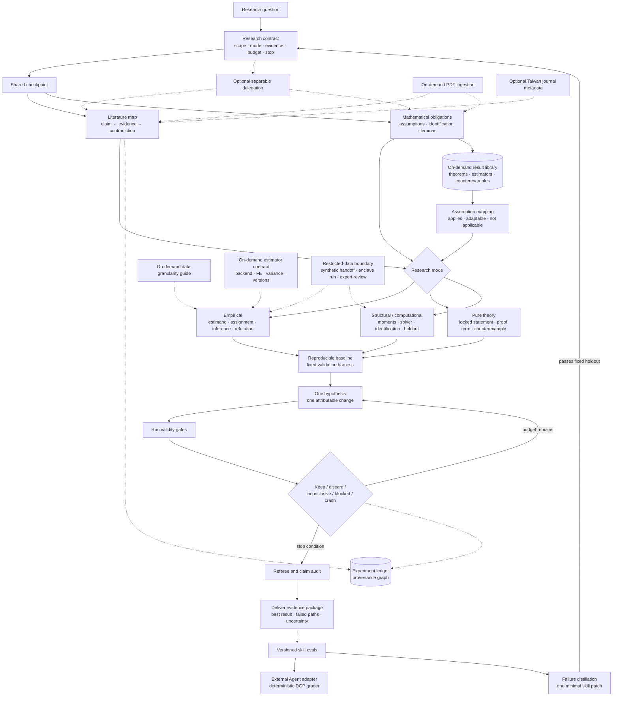

# Econ Research Lab

`econ-research-lab` is an Agent Skill for running auditable economics research with one accountable lead agent and optional specialist delegation. It supports empirical research, Lean-verified pure theory, structural or computational work, and on-demand retrieval from a small economics result-card library.

The design adapts selected ideas without importing their full stacks:

- [autoresearch](https://github.com/karpathy/autoresearch): freeze the evaluation harness, establish a baseline, test one attributable change, and keep an experiment ledger.
- [SkillRL](https://github.com/aiming-lab/SkillRL): distill compact lessons from successful and failed runs, then evolve skills against fixed validation.
- [ponytail](https://github.com/dietrichgebert/ponytail): reuse what exists and add only the smallest solution that survives validation.
- [PaperQA2](https://github.com/Future-House/paper-qa) and [CKM-HypoGen](https://github.com/TaoJinkai/ckm-hypogen): keep claim-level evidence and evaluate prospective ideas against a frozen literature cutoff.
- [agentic-experiments](https://github.com/kadenmc/agentic-experiments): preserve hypothesis → experiment → run → finding provenance.

Unlike a model-training benchmark, economics rarely has one sufficient score. The research contract therefore fixes mode-specific validity gates before iteration; statistical significance is never the optimization target.

## Workflow



The provenance graph links hypotheses, experiments, runs, findings, evidence, and manuscript claims. Skill evolution is a separate, explicitly requested workflow; ordinary research runs never rewrite the live skill.

The lead agent may delegate independent searches or audits when the host supports subagents. It otherwise performs the same checkpoints sequentially.

## Installation

Place this directory at a skill-discovery path supported by the client, for example:

```text
.agents/skills/econ-research-lab/
```

The core follows the [Agent Skills specification](https://agentskills.io/specification) and contains no client-specific orchestration requirements.

## Optional command-line tools

Install the profiler dependencies inside a virtual environment:

```bash
python3 -m venv .venv
.venv/bin/python -m pip install -e .
```

Profile a panel and generate descriptive binned means:

```bash
.venv/bin/python scripts/econ_data_profiler.py \
  --data data.csv --id unit_id --time year \
  --x treatment --y outcome --latex --out-dir output
```

The chart is descriptive unless variables have already been residualized outside the tool.

Query the optional 2019 Taiwan NSTC journal metadata:

```bash
python3 scripts/journal_matcher.py --check "AER"
```

The ranking does not determine whether evidence is relevant or credible. Its source is 林明仁、林常青、張俊仁、曹添旺、楊浩彥（2021），〈經濟學門學術期刊評比更新：2019 年〉，《經濟論文叢刊》，49(3), 395–442.

Search the bundled result-card library by research problem:

```bash
python3 scripts/search_library.py "monotone optimal choice single crossing" --mode theory
python3 scripts/search_library.py "staggered adoption heterogeneous effects" --mode empirical
python3 scripts/search_library.py "dynamic discrete choice computation" --mode structural
python3 scripts/search_library.py --show rust-nested-fixed-point
python3 scripts/validate_library.py
```

Search reads only a compact index and returns three candidates by default. Open one selected Markdown card with `--show`; do not scan all cards into context. Use `--show CARD_ID --blind` during an authorized blind reconstruction. It hides proof and solution sections, but the agent must also avoid opening the underlying Markdown directly until its attempt is saved. A match is a candidate solution, not permission to skip primary-source or assumption verification.

For an agent-generated theorem, lock the theorem type and allowed axioms before proof search, then submit only a proof term:

```bash
python3 scripts/check_lean_proof.py --lock-task proof-task.json --json
python3 scripts/check_lean_proof.py \
  --task proof-task.json --proof candidate.lean \
  --artifact research/proof-attempt-001.json --json
```

The harness generates the theorem around the candidate, checks both statement and task hashes, enforces a timeout, compiles with Lean, and rejects direct or transitive axioms outside the contract allowlist. See `references/lean_harness.md`. The legacy full-file command remains available for trusted files but does not provide statement locking.

Optionally use [MarkItDown](https://github.com/microsoft/markitdown) for first-pass PDF navigation:

```bash
.venv/bin/python -m pip install -e '.[pdf]'
.venv/bin/markitdown paper.pdf -o paper.md
```

For formula-, table-, layout-, or OCR-heavy files, [Docling](https://github.com/docling-project/docling) is an optional router when already available or authorized. Converted output is not authoritative for equations or proof-critical symbols; verify those against rendered PDF pages.

Validate a JSONL research provenance graph and audit Markdown claim markers:

```bash
python3 scripts/validate_research_manifest.py research/manifest.jsonl
python3 scripts/audit_claims.py manuscript.md research/manifest.jsonl --strict-numbers
```

Aggregate independently observed behavior gates for a candidate skill version:

```bash
python3 scripts/run_skill_evals.py --results path/to/results.jsonl
```

The runner does not call or grade an agent by itself. It aggregates evidence supplied by an independent evaluator or deterministic artifact checks. Keep release holdouts outside this public repository.

Skill evolution uses the lightweight offline protocol in `references/skill_evolution.md`. It does not require SkillRL's SFT/RL training stack and never promotes a candidate that fails a fixed validity gate.

Generate deterministic public DGP cases for an external Agent host, then grade its standardized submissions:

```bash
python3 scripts/run_dgp_evals.py generate --out-dir path/to/fixtures
python3 scripts/run_dgp_evals.py grade --results path/to/submissions.jsonl
python3 scripts/run_dgp_evals.py run \
  --adapter path/to/agent-adapter --work-dir path/to/run
```

The repository supplies cases and graders but intentionally does not embed a provider-specific model client. See `references/eval_adapter.md` for the adapter contract and holdout boundary.

## Boundaries

- `econ_data_profiler.py` audits panel structure and descriptive outputs; it is not an estimator. Estimation backends remain project-selected adapters governed by `references/estimation_backends.md`.
- Frozen specifications, DGP checks, sensitivity analysis, and audit trails reduce specification search; they cannot prove an institutional exclusion restriction or eliminate researcher judgment.
- The result library contains 19 high-value method cards, not comprehensive coverage or a substitute for current literature search.
- The locked Lean harness verifies submitted proof terms, but it does not autoformalize economic prose, generate tactics, run MCTS, or provide a broad economics ontology. Reusable Lean economics primitives are added only when an active checked proof needs them.
- Public evals detect deterministic contract regressions; an external host must invoke the agent, preserve trajectories, and keep release holdouts private.
- Restricted data must remain inside its DUA, IRB, enclave, and export boundary. Synthetic fixtures validate code mechanics, not real-data identification, disclosure safety, or estimates.

## Validation

```bash
uvx --from skills-ref agentskills validate "$(pwd)"
python3 -m unittest discover -s tests -v
```

## Structure

```text
SKILL.md                    short router and research loop
references/empirical.md    empirical validity gates
references/theory.md       Lean-backed theory workflow
references/lean_harness.md locked theorem contract and verifier loop
references/estimation_backends.md backend-neutral estimation contract
references/confidential_data.md restricted-data and enclave protocol
references/eval_adapter.md external Agent and DGP eval contract
references/structural.md   structural/computational workflow
references/research_protocol.md  evidence and review protocol
references/research_artifacts.md provenance, claim audit, and eval schemas
references/research_library.md   on-demand result retrieval and blind mode
references/pdf_ingestion.md      optional PDF ingestion and verification
references/skill_evolution.md    offline failure-driven skill evolution
library/index.jsonl             compact result-card search index
library/papers/*.md             one on-demand Markdown result card per file
library/catalog.jsonl           paper metadata and source links
library/relations.jsonl         typed links among result cards
evals/cases.jsonl                public development cases and validity gates
evals/dgp_cases.jsonl            deterministic empirical design cases
scripts/                    optional deterministic utilities
tests/                      CLI and invariant checks
```

MIT licensed.
