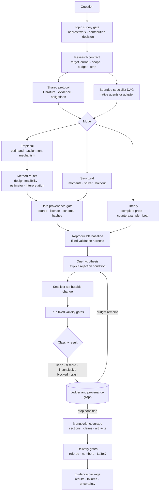

# Invisible Hands for Economists

An auditable Agent Skill for empirical, theoretical, and structural economics research. One accountable PI can coordinate bounded specialists, discover and verify data, develop complete or Lean-checked proofs, run reproducible analyses, and audit a manuscript from evidence to conclusion.

Skill ID: `econ-research-lab`.

## Architecture



The loop is bounded by the research contract. It keeps the validation harness fixed, changes one attributable element per iteration, and records both successful and failed paths.

## Capabilities

- Surveys the nearest literature before selecting a method or claiming novelty.
- Routes empirical questions from the estimand and assignment mechanism to design-specific diagnostics.
- Provides modern econometric estimation recipes across Stata, R, and Python with publication-ready output.
- Enforces a competing mechanisms matrix and falsification battery (placebo timing/units, negative controls, Oster bounds) before claiming causality.
- Supports complete theory proofs, counterexample search, and optional Lean 4 verification.
- Supports structural estimation with fixed moments, solver tolerances, holdouts, and numerical checks.
- Verifies data provenance, lawful literature acquisition, checksums, result bindings, and argument graphs.
- Enforces AEA-grade replication package audits (relative paths, seed locks, raw data immutability, and single master execution scripts).
- Simulates pre-submission adversarial peer review across econometric, mechanism, and data referee archetypes.
- Builds manuscripts from evidence-backed section packets and modular appendices; page count follows validated evidence and outlet constraints.
- Adapts genre-level outlet conventions without using journal prestige as an evidence filter or imitating individual authors.
- Coordinates bounded specialist tasks while keeping final research decisions with one accountable PI.

## Install

Choose project scope when a repository should share the skill, or global scope when it should be available in every workspace. Install only one scope per client to avoid duplicate discovery.

### Codex

[Codex loads](https://developers.openai.com/codex/skills) project skills from `.agents/skills` and personal skills from `$HOME/.agents/skills`.

```bash
# Project scope — run from the target repository root
mkdir -p .agents/skills
git clone https://github.com/Tohskcid/invisible-hands-for-economists.git \
  .agents/skills/econ-research-lab

# Global scope — use instead of project scope
mkdir -p "$HOME/.agents/skills"
git clone https://github.com/Tohskcid/invisible-hands-for-economists.git \
  "$HOME/.agents/skills/econ-research-lab"
```

Start Codex in the project and request an economics research task, or invoke `$econ-research-lab` explicitly. Restart Codex only if the newly installed skill does not appear.

### Claude Code

[Claude Code loads](https://code.claude.com/docs/en/skills) project skills from `.claude/skills` and personal skills from `~/.claude/skills`.

```bash
# Project scope — run from the target repository root
mkdir -p .claude/skills
git clone https://github.com/Tohskcid/invisible-hands-for-economists.git \
  .claude/skills/econ-research-lab

# Global scope — use instead of project scope
mkdir -p "$HOME/.claude/skills"
git clone https://github.com/Tohskcid/invisible-hands-for-economists.git \
  "$HOME/.claude/skills/econ-research-lab"
```

Ask a matching research question for automatic activation or run `/econ-research-lab`. If the top-level skills directory was created after Claude Code started and is not detected, restart the session.

### Google Antigravity

[Antigravity loads](https://antigravity.google/docs/skills) workspace skills from `.agents/skills` and global skills from `~/.gemini/config/skills`.

```bash
# Workspace scope — run from the target workspace root
mkdir -p .agents/skills
git clone https://github.com/Tohskcid/invisible-hands-for-economists.git \
  .agents/skills/econ-research-lab

# Global scope — use instead of workspace scope
mkdir -p "$HOME/.gemini/config/skills"
git clone https://github.com/Tohskcid/invisible-hands-for-economists.git \
  "$HOME/.gemini/config/skills/econ-research-lab"
```

Open the workspace in Antigravity and ask an economics research question that matches the skill description.

### Optional Python tools

The instructions-only workflow needs no package installation. Install the optional profiler dependencies inside the cloned skill directory when required:

```bash
python3 -m venv .venv
.venv/bin/python -m pip install -e .
```

## Main tools

| Tool | Purpose |
| --- | --- |
| `econ_data_profiler.py` | Panel keys, missingness, balance, descriptive bins, LaTeX/SVG output |
| `check_data_provenance.py` | Verify source, license, acquisition, schema, and file hashes for real, restricted, or proxy data |
| `check_literature_archive.py` | Check bibliography coverage, lawful access records, PDF signatures, names, and hashes |
| `check_manuscript_coverage.py` | Bind every manuscript section and claim to code, results, exhibits, diagnostics, and appendices |
| `check_topic_survey.py` | Validate nearest-work coverage and the pre-design contribution decision |
| `search_library.py` | Retrieve a small number of candidate result cards without loading the library |
| `check_lean_proof.py` | Lock theorem statements and audit Lean proof terms and axioms |
| `validate_research_manifest.py` / `audit_claims.py` | Validate provenance, proxy scope, argument DAGs, and manuscript markers |
| `check_result_bindings.py` | Bind displayed manuscript numbers and a results-file hash to structured estimates |
| `check_design_audit.py` | Enforce diagnostics selected for the declared empirical design |
| `check_research_package.py` | Run applicable manifest, manuscript, result, design, and LaTeX gates for CI |
| `check_latex.py` | Compile safely, inspect logs, render every page, and bind visual review to the PDF hash |
| `check_logic_review.py` | Bind a central-claim referee report to manuscript and manifest hashes |
| `run_research_team.py` | Validate and run a bounded provider-neutral specialist task DAG |
| `run_dgp_evals.py` / `run_skill_evals.py` | External-agent regression and deterministic design checks |

Detailed contracts live in `references/`. Run the applicable tools directly or declare them in `research/package.json` and execute `python3 scripts/check_research_package.py --root .`.

## Boundaries

- Statistical significance is never an optimization target.
- Target-journal fit affects framing and format, not evidence inclusion.
- Proxy data support feasibility and code validation, not undisclosed real-world claims.
- Quantitative results are blocked until their data source, license, acquisition, schema, and checksums pass the provenance gate.
- Generated files stay in purpose-specific directories; every cited paper is downloaded and consistently named when lawful access exists, otherwise its verified access gap is recorded.
- Restricted data remain inside their approved enclave and export policy.
- Numerical examples do not prove theorems; `formally proved` requires the locked Lean 4 + Mathlib gate.
- LaTeX compilation and argument graphs do not prove visual quality or natural-language entailment; independent review remains required.
- Skill evolution is explicit and evaluated against fixed gates; ordinary research runs never rewrite the skill.

## Validate

```bash
uvx --from skills-ref agentskills validate "$(pwd)"
python3 -m unittest discover -s tests -v
python3 scripts/validate_library.py --json
```

MIT licensed.
