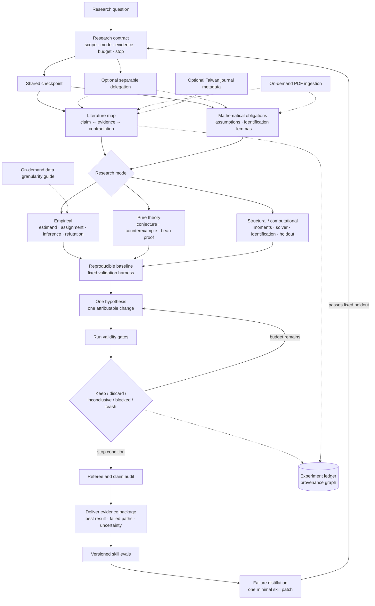

# Econ Research Lab

`econ-research-lab` is an Agent Skill for running auditable economics research with one accountable lead agent and optional specialist delegation. It supports empirical research, Lean-verified pure theory, and structural or computational work.

The design adapts selected ideas without importing their full stacks:

- [autoresearch](https://github.com/karpathy/autoresearch): freeze the evaluation harness, establish a baseline, test one attributable change, and keep an experiment ledger.
- [SkillRL](https://github.com/aiming-lab/SkillRL): distill compact lessons from successful and failed runs, then evolve skills against fixed validation.
- [ponytail](https://github.com/dietrichgebert/ponytail): reuse what exists and add only the smallest solution that survives validation.
- [PaperQA2](https://github.com/Future-House/paper-qa) and [CKM-HypoGen](https://github.com/TaoJinkai/ckm-hypogen): keep claim-level evidence and evaluate prospective ideas against a frozen literature cutoff.
- [agentic-experiments](https://github.com/kadenmc/agentic-experiments): preserve hypothesis → experiment → run → finding provenance.

Unlike a model-training benchmark, economics rarely has one sufficient score. The research contract therefore fixes mode-specific validity gates before iteration; statistical significance is never the optimization target.

## Workflow



The provenance graph links hypotheses, experiments, runs, findings, evidence, and manuscript claims. Skill evolution is a separate, explicitly requested workflow; ordinary research runs never rewrite the live skill.

The lead agent may delegate independent searches or audits when the host supports subagents. It otherwise performs the same checkpoints sequentially.

## Installation

Place this directory at a skill-discovery path supported by the client, for example:

```text
.agents/skills/econ-research-lab/
```

The core follows the [Agent Skills specification](https://agentskills.io/specification) and contains no client-specific orchestration requirements.

## Optional command-line tools

Install the profiler dependencies inside a virtual environment:

```bash
python3 -m venv .venv
.venv/bin/python -m pip install -e .
```

Profile a panel and generate descriptive binned means:

```bash
.venv/bin/python scripts/econ_data_profiler.py \
  --data data.csv --id unit_id --time year \
  --x treatment --y outcome --latex --out-dir output
```

The chart is descriptive unless variables have already been residualized outside the tool.

Query the optional 2019 Taiwan NSTC journal metadata:

```bash
python3 scripts/journal_matcher.py --check "AER"
```

The ranking does not determine whether evidence is relevant or credible. Its source is 林明仁、林常青、張俊仁、曹添旺、楊浩彥（2021），〈經濟學門學術期刊評比更新：2019 年〉，《經濟論文叢刊》，49(3), 395–442.

Verify a Lean theorem before labeling it formally proved:

```bash
python3 scripts/check_lean_proof.py path/to/Theorem.lean
```

Optionally use [MarkItDown](https://github.com/microsoft/markitdown) for first-pass PDF navigation:

```bash
.venv/bin/python -m pip install -e '.[pdf]'
.venv/bin/markitdown paper.pdf -o paper.md
```

For formula-, table-, layout-, or OCR-heavy files, [Docling](https://github.com/docling-project/docling) is an optional router when already available or authorized. Converted output is not authoritative for equations or proof-critical symbols; verify those against rendered PDF pages.

Validate a JSONL research provenance graph and audit Markdown claim markers:

```bash
python3 scripts/validate_research_manifest.py research/manifest.jsonl
python3 scripts/audit_claims.py manuscript.md research/manifest.jsonl --strict-numbers
```

Aggregate independently observed behavior gates for a candidate skill version:

```bash
python3 scripts/run_skill_evals.py --results path/to/results.jsonl
```

The runner does not call or grade an agent by itself. It aggregates evidence supplied by an independent evaluator or deterministic artifact checks. Keep release holdouts outside this public repository.

Skill evolution uses the lightweight offline protocol in `references/skill_evolution.md`. It does not require SkillRL's SFT/RL training stack and never promotes a candidate that fails a fixed validity gate.

## Validation

```bash
uvx --from skills-ref agentskills validate "$(pwd)"
python3 -m unittest discover -s tests -v
```

## Structure

```text
SKILL.md                    short router and research loop
references/empirical.md    empirical validity gates
references/theory.md       Lean-backed theory workflow
references/structural.md   structural/computational workflow
references/research_protocol.md  evidence and review protocol
references/research_artifacts.md provenance, claim audit, and eval schemas
references/pdf_ingestion.md      optional PDF ingestion and verification
references/skill_evolution.md    offline failure-driven skill evolution
evals/cases.jsonl                public development cases and validity gates
scripts/                    optional deterministic utilities
tests/                      CLI and invariant checks
```

MIT licensed.
