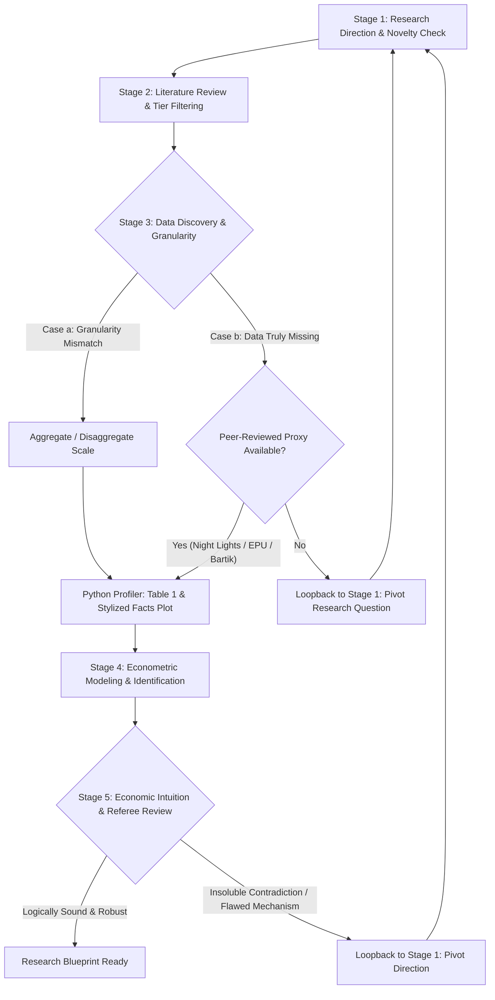

# Econ Research Lab (`econ-research-lab`)

> **Multi-Agent AI Skills for Economics Research & Causal Inference**  
> An open-source, end-to-end simulated economic research team (PI, Lit Reviewer, Data Engineer, Econometrician, Critical Referee) designed to optimize token efficiency and enforce publication-grade causal inference standards.

[](https://agentskills.io/home)
[](https://opensource.org/licenses/MIT)
[](#quick-start)

---

## 🌟 Why Econ Research Lab?

Conducting modern empirical economics research requires rigorous methodological discipline—from identifying genuine research gaps and filtering top-tier journals, to handling spatial/temporal granularity mismatches and defending against endogeneity threats. 

However, existing LLM workflows suffer from two major pain points:
1. **Context Bloat & Token Waste**: Dumping massive raw CSVs, regression logs, or 60-page PDF transcripts burns tens of thousands of tokens and degrades LLM reasoning precision.
2. **Methodological Hallucinations**: Standard models frequently suggest naive OLS regressions without addressing omitted variable bias, selection sorting, or modern staggered Difference-in-Differences (DiD) negative-weighting pitfalls.

**`econ-research-lab` solves this by introducing:**
- 📉 **Strict Token Efficiency (Code-Offloading)**: Summary statistics (Table 1) and binned scatterplots are calculated deterministically in pure Python without third-party dependencies, returning < 300 tokens of clean markdown/LaTeX to the LLM.
- 🏛️ **Taiwan NSTC 2019 Journal Tier Filter**: Hardcoded classification based on *Lin, Lin, Chang, Tsaur, & Yang (2019/2021)*, instantly categorizing literature into Top 5, Leading Surveys, Field A+, Field A, and Core TSSCI.
- 🔬 **Modern Econometric Guardrails**: Built-in adherence to modern causal inference standards (Callaway-Sant'Anna / Sun-Abraham staggered DiD, Oster coefficient stability bounding, Conley spatial HAC errors, McCrary RDD density tests).
- 🤝 **Simulated 5-Agent Research Team**: End-to-end collaboration with automated loopbacks if data is missing or results contradict economic intuition.

---

## 👥 Simulated Research Team (Multi-Agent Architecture)

| Agent Role | Title | Core Responsibilities |
| :--- | :--- | :--- |
| **Agent PI** | Principal Investigator | Hypothesis framing, economic intuition audit, feasibility & loopback decisions |
| **Agent LitSpecialist** | Literature & Novelty Specialist | Gap identification, semantic synthesis, 2019 NSTC Top 5 / A+ / A / TSSCI filtering |
| **Agent DataDoc** | Data Engineer & Profiler | Spatial/temporal granularity aggregation, missing proxy checks, Table 1 & stylized fact plots |
| **Agent Econometrician** | Econometrician & Identification Specialist | Causal model specification, 4 endogeneity audits, cluster standard errors, robustness checks |
| **Agent Referee** | Top-Tier Journal Reviewer | Devil's advocate (AER/QJE style), 3 major conceptual objections & 5 minor technical checks |

---

## 🔄 End-to-End 5-Stage Workflow



### Stage 1: Direction & Novelty Verification
- **Empirical**: Has this question been answered? If yes, identify margins of contribution (new institutional context, temporal structural breaks such as AI boom, superior identification).
- **Theoretical**: Has the game/friction been solved? Can it derive novel, testable predictions?
- **Output**: 1-Page [Research Canvas](templates/research_canvas.md).

### Stage 2: Literature Review & 2019 NSTC Tier Filtering
- Filters literature strictly by the 2019 Taiwan Ministry of Science and Technology (NSTC) Economics Evaluation (*Lin, Lin, Chang, Tsaur, & Yang, 2019/2021*):
  - **Top 5**: *AER, Econometrica, JPE, QJE, REStud*
  - **Leading Surveys**: *JEL, JEP*
  - **Field A+**: *REStat, JEEA, EJ, AEJ (Applied/Macro/Policy/Micro), JoE, JET, JME, JF, JoLE, JPubE, RAND, JDE, JIE, JEEM*
  - **Field A**: *EER, JEBO, JHR, JEDC, JUE, Energy Economics*, etc.
  - **TSSCI Core**: *Taiwan Economic Review (經濟論文叢刊), Academia Economic Papers (經濟論文), Economic Research (經濟研究), Journal of Social Sciences and Philosophy (人文及社會科學集刊)*
- Instant lookup utility: `python3 scripts/journal_matcher.py --check "AER"`

### Stage 3: Data Discovery, Granularity Conversion & Profiling
- **Case a (Granularity Mismatch)**:
  - Spatial: Point coordinate $\to$ County $\to$ Commuting Zone $\to$ State (population weighted).
  - Temporal: Flows (Sum), Stocks (End-of-period or Period average), Prices (deflated volume-weighted).
  - Run profiler: `python3 scripts/econ_data_profiler.py -d data.csv --latex -x treatment -y outcome`
  - Generates Table 1 Summary Statistics (Markdown & LaTeX) + Binned Scatterplot (ASCII & standalone publication-grade SVG).
- **Case b (Truly Missing Data)**:
  - Check peer-reviewed proxies (Nighttime lights for GDP, text-based EPU, Bartik shift-share).
  - If no literature support exists $\to$ **Hard stop & automatic loopback to Stage 1**.

### Stage 4: Econometric Identification & Modeling
- Fourfold endogeneity defense: Omitted Variable Bias (OVB), Simultaneity / Reverse Causality, Selection / Sorting, Measurement Error.
- Modern Staggered DiD: Pre-trend event study tests, Bacon decomposition defense, Callaway & Sant'Anna (2021) / Sun & Abraham (2021) estimators.
- Standard errors clustered at treatment assignment level; Wild Cluster Bootstrap for small cluster counts ($G < 30$).
- Output: [Empirical Specification Card](templates/empirical_specification_card.md).

### Stage 5: Economic Intuition, Interpretation & Referee Loop
- Assess economic significance and elasticity magnitudes against economic theory.
- **Handling Contradictions & Puzzles**: Formulate institutionally supported mechanisms (e.g., long-term Power Purchase Agreements (PPAs), economies of scale in infrastructure, cross-subsidization). If indefensible, **loop back to Stage 1**.
- Simulated Top-Journal Referee Review: [Top-Tier Referee Report](templates/referee_report_template.md).

---

## 📁 Repository Structure

```
econ-research-lab/
├── SKILL.md                               # Primary agent skill instructions & orchestrator
├── README.md                              # Repository overview & usage documentation
├── LICENSE                                # MIT License
├── references/                            # Domain playbooks (Progressively loaded)
│   ├── journal_rankings_2019.md           # Full 2019 Taiwan NSTC Economics Ranking database
│   ├── econometrics_playbook.md           # Modern causal inference & empirical playbook
│   ├── data_granularity_guide.md          # Spatial/temporal aggregation & proxy methods
│   └── token_saving_protocols.md          # Token budgeting, state cards & handshake protocols
├── scripts/                               # Standalone CLI tools (Zero Token consumption)
│   ├── journal_matcher.py                 # 2019 ranking fuzzy matcher & CLI tool
│   └── econ_data_profiler.py              # Table 1 stats & binned scatterplot generator
└── templates/                             # Standardized research communication cards
    ├── research_canvas.md                 # 1-page structured research proposal template
    ├── empirical_specification_card.md    # Econometric model specification card
    └── referee_report_template.md         # Top-tier journal referee review scorecard
```

---

## 🚀 Quick Start

### Installation

#### 1. Claude Code
```bash
mkdir -p ~/.claude/skills
cp -r path/to/econ-research-lab ~/.claude/skills/
```

#### 2. Cursor
```bash
mkdir -p ~/.cursor/skills
cp -r path/to/econ-research-lab ~/.cursor/skills/
```

#### 3. Gemini CLI / Antigravity
```bash
mkdir -p ~/.gemini/config/plugins/personal-skills/skills
cp -r path/to/econ-research-lab ~/.gemini/config/plugins/personal-skills/skills/
```

#### 4. Project-Level (Any AI Agent Workspace)
Place directly in `.agents/skills/econ-research-lab/` at the root of your project repository.

---

## 🛠️ CLI Utilities Usage

### 1. Journal Matcher (`scripts/journal_matcher.py`)
```bash
# Check any journal or acronym
python3 scripts/journal_matcher.py --check "American Economic Review"
python3 scripts/journal_matcher.py --check "JoE"
python3 scripts/journal_matcher.py --check "經濟論文叢刊"

# List all journals in a tier
python3 scripts/journal_matcher.py --list-tier "Top 5"
python3 scripts/journal_matcher.py --list-tier "A+"
```

### 2. Econ Data Profiler (`scripts/econ_data_profiler.py`)
```bash
# Run panel audit, compute Table 1 (Markdown + LaTeX), and plot binned scatterplot
python3 scripts/econ_data_profiler.py \
  --data "data/county_panel.csv" \
  --id "fips_county" \
  --time "year" \
  --x "datacenter_active" \
  --y "elec_price_cents_kwh" \
  --latex \
  --out-dir "output"
```

---

## 📜 Citation & Reference

If you use this skill or reference the 2019 Taiwan NSTC ranking in your research, please cite:

> 林明仁、林常青、張俊仁、曹添旺、楊浩彥（2021），〈經濟學門學術期刊評比更新：2019 年〉，《經濟論文叢刊》(Taiwan Economic Review), 49(3), 395-442。

---

## 📄 License

Distributed under the [MIT License](LICENSE).
