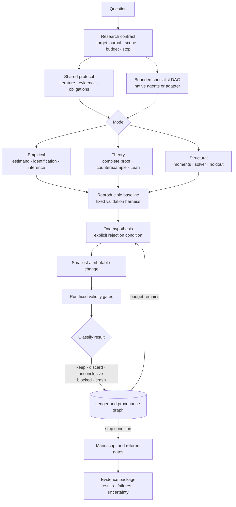

# Invisible Hands for Economists

An auditable Agent Skill for empirical, theoretical, and structural economics research. One accountable PI can coordinate bounded specialists, discover and verify data, develop complete or Lean-checked proofs, run reproducible analyses, and audit a manuscript from evidence to conclusion.

The installed skill ID remains `econ-research-lab` for compatibility; the repository and project are **Invisible Hands for Economists**.

## Architecture



This is a bounded engineering loop, not open-ended self-prompting. The harness stays fixed, each iteration changes one attributable element, only a valid improvement updates the current best result, and every failed path remains in the ledger. The loop exits at the contract's budget, milestone, or stop condition.

`SKILL.md` is a 535-word router. It loads the shared protocol plus only the active research mode and any triggered reference. Raw data, papers, logs, proof traces, and page renders remain artifacts; agent handoffs contain decisions, evidence locations, uncertainty, and next actions.

## Install

Place this repository at a client-supported Agent Skills path:

```text
.agents/skills/econ-research-lab/
```

Optional profiler dependencies:

```bash
python3 -m venv .venv
.venv/bin/python -m pip install -e .
```

## Main tools

| Tool | Purpose |
| --- | --- |
| `econ_data_profiler.py` | Panel keys, missingness, balance, descriptive bins, LaTeX/SVG output |
| `search_library.py` | Retrieve a small number of candidate result cards without loading the library |
| `check_lean_proof.py` | Lock theorem statements and audit Lean proof terms and axioms |
| `validate_research_manifest.py` / `audit_claims.py` | Validate provenance, proxy scope, argument DAGs, and manuscript markers |
| `check_latex.py` | Compile safely, inspect logs, render every page, and bind visual review to the PDF hash |
| `check_logic_review.py` | Bind a central-claim referee report to manuscript and manifest hashes |
| `run_research_team.py` | Validate and run a bounded provider-neutral specialist task DAG |
| `run_dgp_evals.py` / `run_skill_evals.py` | External-agent regression and deterministic design checks |

Examples:

```bash
python3 scripts/search_library.py "monotone optimal choice" --mode theory
python3 scripts/validate_research_manifest.py research/manifest.jsonl --require-argument-graph
python3 scripts/check_latex.py check --main paper/main.tex \
  --build-dir research/latex-build --report research/latex-report.json
python3 scripts/run_research_team.py validate research/team-plan.json
```

Detailed contracts live beside their mode in `references/`; tests and public behavior cases define release invariants. The result cards are navigation aids, not primary sources or comprehensive coverage.

## Boundaries

- Statistical significance is never an optimization target.
- Target-journal fit affects framing and format, not evidence inclusion.
- Proxy data support feasibility and code validation, not undisclosed real-world claims.
- Restricted data remain inside their approved enclave and export policy.
- Numerical examples do not prove theorems; `formally proved` requires the locked Lean 4 + Mathlib gate.
- LaTeX compilation and argument graphs do not prove visual quality or natural-language entailment; independent review remains required.
- Skill evolution is explicit and evaluated against fixed gates; ordinary research runs never rewrite the skill.

## Validate

```bash
uvx --from skills-ref agentskills validate "$(pwd)"
python3 -m unittest discover -s tests -v
python3 scripts/validate_library.py --json
```

MIT licensed.
