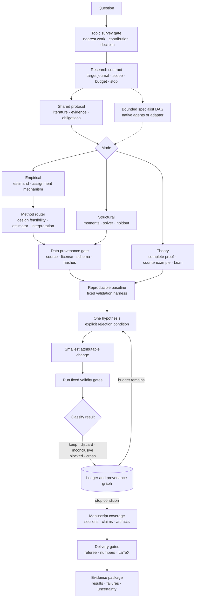

# Invisible Hands for Economists

An auditable Agent Skill for empirical, theoretical, and structural economics research. One accountable PI can coordinate bounded specialists, discover and verify data, develop complete or Lean-checked proofs, run reproducible analyses, and audit a manuscript from evidence to conclusion.

The installed skill ID remains `econ-research-lab` for compatibility; the repository and project are **Invisible Hands for Economists**.

## Architecture



This is a bounded engineering loop, not open-ended self-prompting. The harness stays fixed, each iteration changes one attributable element, only a valid improvement updates the current best result, and every failed path remains in the ledger. The loop exits at the contract's budget, milestone, or stop condition.

`SKILL.md` is a compact router. It loads the shared protocol plus only the active research mode and any triggered reference. Raw data, papers, logs, proof traces, and page renders remain artifacts; agent handoffs contain decisions, evidence locations, uncertainty, and next actions.

## Target outlets and manuscript fit

`library/journals.jsonl` registers the selected general-economics outlets and the finance outlets The Journal of Finance, Journal of Financial Economics, The Review of Financial Studies, Journal of Financial and Quantitative Analysis, and Review of Finance. The registry is a target-outlet menu, not an evidence or quality filter.

When an outlet-specific manuscript is requested, the agent builds a source-grounded profile from official author instructions and a lawful, diverse article sample. Inspired by [Distilly](https://github.com/titanwings/distilly), it separates observations from inference, records source locators and confidence, preserves exceptions, and incrementally updates the profile. It extracts genre-level architecture and conventions rather than copying phrases or imitating an individual author. Only the selected profile is loaded during drafting.

Before style adaptation, the manuscript must pass four research-merit gates: identification; economic mechanism and defensible counterfactuals; data and econometric quality; and contribution, external validity, and policy relevance. Outlet fit cannot compensate for a failed gate.

## Method routing

For empirical work, the router first fixes the estimand and institutional assignment mechanism, then uses data properties to test feasibility and choose an estimator. It distinguishes descriptive or predictive work, natural-experiment designs, DiD, IV/LATE, sharp and fuzzy RDD, synthetic control/SDID, selection-on-observables, panel fixed effects, interrupted time series, finance market event studies, spatial/network exposure, DML, and structural counterfactuals. The output records rejected alternatives and interpretation boundaries; a specialized model never substitutes for identification.

The selected design receives its own deterministic audit obligations. A DiD audit is not an IV audit, and neither is forced through a universal robustness checklist. Failed or inconclusive diagnostics narrow or block the claim rather than silently switching the project to a different model.

For a new question, a topic-survey gate runs before this method router. It compares verified nearest works by question, estimand or theorem, mechanism, data/model class, method, and scope, then chooses `proceed`, `reframe`, `replicate`, `stop`, or `blocked`. No search hit is never treated as proof of novelty.

## Manuscript scale

The skill has no 20-page ceiling. It builds empirical papers from evidence-backed section packets and modular appendices rather than asking one model call to expand an entire manuscript. Institutional context, data construction, identification, results, design-specific diagnostics, mechanisms, heterogeneity, external validity, and appendices are included only when supported by artifacts. Page count is an outlet constraint and a consequence of evidence, never the optimization target.

## Install

Choose project scope when a repository should share the skill, or global scope when it should be available in every workspace. Install only one scope per client to avoid duplicate discovery. The folder remains `econ-research-lab` because it matches the skill ID.

### Codex

[Codex loads](https://developers.openai.com/codex/skills) project skills from `.agents/skills` and personal skills from `$HOME/.agents/skills`.

```bash
# Project scope — run from the target repository root
mkdir -p .agents/skills
git clone https://github.com/Tohskcid/invisible-hands-for-economists.git \
  .agents/skills/econ-research-lab

# Global scope — use instead of project scope
mkdir -p "$HOME/.agents/skills"
git clone https://github.com/Tohskcid/invisible-hands-for-economists.git \
  "$HOME/.agents/skills/econ-research-lab"
```

Start Codex in the project and request an economics research task, or invoke `$econ-research-lab` explicitly. Restart Codex only if the newly installed skill does not appear.

### Claude Code

[Claude Code loads](https://code.claude.com/docs/en/skills) project skills from `.claude/skills` and personal skills from `~/.claude/skills`.

```bash
# Project scope — run from the target repository root
mkdir -p .claude/skills
git clone https://github.com/Tohskcid/invisible-hands-for-economists.git \
  .claude/skills/econ-research-lab

# Global scope — use instead of project scope
mkdir -p "$HOME/.claude/skills"
git clone https://github.com/Tohskcid/invisible-hands-for-economists.git \
  "$HOME/.claude/skills/econ-research-lab"
```

Ask a matching research question for automatic activation or run `/econ-research-lab`. If the top-level skills directory was created after Claude Code started and is not detected, restart the session.

### Google Antigravity

[Antigravity loads](https://antigravity.google/docs/skills) workspace skills from `.agents/skills` and global skills from `~/.gemini/config/skills`.

```bash
# Workspace scope — run from the target workspace root
mkdir -p .agents/skills
git clone https://github.com/Tohskcid/invisible-hands-for-economists.git \
  .agents/skills/econ-research-lab

# Global scope — use instead of workspace scope
mkdir -p "$HOME/.gemini/config/skills"
git clone https://github.com/Tohskcid/invisible-hands-for-economists.git \
  "$HOME/.gemini/config/skills/econ-research-lab"
```

Open the workspace in Antigravity and ask an economics research question that matches the skill description.

### Optional Python tools

The instructions-only workflow needs no package installation. Install the optional profiler dependencies inside the cloned skill directory when required:

```bash
python3 -m venv .venv
.venv/bin/python -m pip install -e .
```

## Main tools

| Tool | Purpose |
| --- | --- |
| `econ_data_profiler.py` | Panel keys, missingness, balance, descriptive bins, LaTeX/SVG output |
| `check_data_provenance.py` | Verify source, license, acquisition, schema, and file hashes for real, restricted, or proxy data |
| `check_literature_archive.py` | Check bibliography coverage, lawful access records, PDF signatures, names, and hashes |
| `check_manuscript_coverage.py` | Bind every manuscript section and claim to code, results, exhibits, diagnostics, and appendices |
| `check_topic_survey.py` | Validate nearest-work coverage and the pre-design contribution decision |
| `search_library.py` | Retrieve a small number of candidate result cards without loading the library |
| `check_lean_proof.py` | Lock theorem statements and audit Lean proof terms and axioms |
| `validate_research_manifest.py` / `audit_claims.py` | Validate provenance, proxy scope, argument DAGs, and manuscript markers |
| `check_result_bindings.py` | Bind displayed manuscript numbers and a results-file hash to structured estimates |
| `check_design_audit.py` | Enforce diagnostics selected for the declared empirical design |
| `check_research_package.py` | Run applicable manifest, manuscript, result, design, and LaTeX gates for CI |
| `check_latex.py` | Compile safely, inspect logs, render every page, and bind visual review to the PDF hash |
| `check_logic_review.py` | Bind a central-claim referee report to manuscript and manifest hashes |
| `run_research_team.py` | Validate and run a bounded provider-neutral specialist task DAG |
| `run_dgp_evals.py` / `run_skill_evals.py` | External-agent regression and deterministic design checks |

Examples:

```bash
python3 scripts/search_library.py "monotone optimal choice" --mode theory
python3 scripts/check_topic_survey.py research/topic-survey.json --json
python3 scripts/check_data_provenance.py research/data-provenance.json --root . --json
python3 scripts/check_literature_archive.py research/literature-archive.json \
  --bibliography paper/references.bib --root . --require-complete --json
python3 scripts/check_manuscript_coverage.py research/manuscript-coverage.json \
  --manuscript paper/main.tex --manifest research/manifest.jsonl \
  --root . --require-ready --json
python3 scripts/validate_research_manifest.py research/manifest.jsonl --require-argument-graph
python3 scripts/check_result_bindings.py --results research/results.json --manuscript paper/main.tex --root .
python3 scripts/check_design_audit.py research/design-audit.json --root . --require-pass
python3 scripts/check_latex.py check --main paper/main.tex \
  --build-dir research/latex-build --report research/latex-report.json
python3 scripts/run_research_team.py validate research/team-plan.json
```

Detailed contracts live beside their mode in `references/`; tests and public behavior cases define release invariants. The result cards are navigation aids, not primary sources or comprehensive coverage.

## Boundaries

- Statistical significance is never an optimization target.
- Target-journal fit affects framing and format, not evidence inclusion.
- Proxy data support feasibility and code validation, not undisclosed real-world claims.
- Quantitative results are blocked until their data source, license, acquisition, schema, and checksums pass the provenance gate.
- Generated files stay in purpose-specific directories; every cited paper is downloaded and consistently named when lawful access exists, otherwise its verified access gap is recorded.
- Restricted data remain inside their approved enclave and export policy.
- Numerical examples do not prove theorems; `formally proved` requires the locked Lean 4 + Mathlib gate.
- LaTeX compilation and argument graphs do not prove visual quality or natural-language entailment; independent review remains required.
- Skill evolution is explicit and evaluated against fixed gates; ordinary research runs never rewrite the skill.

## Validate

```bash
uvx --from skills-ref agentskills validate "$(pwd)"
python3 -m unittest discover -s tests -v
python3 scripts/validate_library.py --json
```

MIT licensed.
