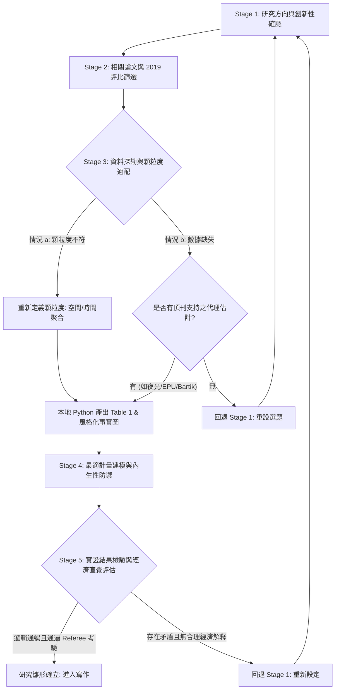

# Economics Research Lab (`econ-research-lab`)

> **模擬頂尖經濟學研究團隊（PI、文獻專家、資料工程師、計量學家、審稿人）的端到端（End-to-End）研究流水線。**  
> 專為極大化實證與理論研究精確性、杜絕上下文幻覺、並透過程式碼卸載與結構化卡片大幅節省 Token 而設計。

---

## 核心設計理念與價值主張

1. **極致節省 Token (Token Efficiency)**：
   - 拒絕將數萬行原始數據與冗長對話塞入 LLM 上下文。
   - 數據清洗、追蹤結構檢定、Table 1 敘述統計與可視化一律由本地 Python 腳本（`econ_data_profiler.py`）無損運算，僅向模型回傳 < 300 Tokens 之統計精華。
   - 2019 國科會期刊評比由本地工具（`journal_matcher.py`）秒級匹配，杜絕大模型檢索幻覺。
   - 各 Agent 之間以極簡 Markdown 卡片（`research_canvas.md`、`empirical_specification_card.md`、`referee_report_template.md`）進行無狀態交付。
2. **頂刊方法論與因果識別 (Econometric Rigor)**：
   - 嚴格遵守現代應用個體計量標準（Angrist & Pischke 因果革命、Callaway & Sant'Anna 2021 交錯 DiD、Oster 2019 係數穩定性、Conley 空間標準誤）。
3. **臺灣國科會 2019 期刊評比嚴格對標**：
   - 內建林明仁、林常青、張俊仁、曹添旺、楊浩彥（2019/2021）之評比標準，精準分流 Top 5、A+、A 及 TSSCI 核心第一級。
4. **具備自動回退機制的閉環驗證 (Closed-Loop Feedback)**：
   - 資料真正缺失時先尋求頂刊認可的代理變數，若無則自動回退 Stage 1。
   - 實證結果若違背經濟直覺且無法提出合理機制解釋，自動回退 Stage 1 重新擬定方向。

---

## 多 Agent 研究團隊架構 (Multi-Agent Research Team)

本 Skill 模擬五位各司其職的經濟學專家角色：

```
┌────────────────────────────────────────────────────────────────────────┐
│                        ECON RESEARCH LAB TEAM                          │
├────────────────────────────────────────────────────────────────────────┤
│ 1. 實驗室主持人 (Agent PI / Director)                                  │
│    - 統籌研究節奏、裁定研究選題、審視經濟直覺、決策是否觸發階段回退。      │
│ 2. 文獻與創新性專家 (Agent LitSpecialist)                                │
│    - 檢驗研究邊界、使用 journal_matcher 過濾 2019 Top 5/A+/A/TSSCI 期刊。│
│ 3. 資料工程與風格化事實專家 (Agent DataDoc)                             │
│    - 執行空間/時間顆粒度轉換、執行 econ_data_profiler 產出 Table 1 與圖表。 │
│ 4. 計量識別與因果推論專家 (Agent Econometrician)                         │
│    - 擬定最佳實證模型、診斷 4 大內生性來源、設定群聚標準誤與穩健性檢定。     │
│ 5. 匿名審稿人 / 反方辯友 (Agent Referee)                               │
│    - AER/QJE 審查風格，提出 3 大核心因果質疑與 5 大技術檢驗，把關科學嚴謹。│
└────────────────────────────────────────────────────────────────────────┘
```

---

## 五階段端到端標準作業程序 (The 5-Stage SOP)



---

### Stage 1: 研究方向確認與創新性檢驗 (Novelty Audit)

**主責 Agent**：`Agent PI` 協同 `Agent LitSpecialist`

#### 執行步驟：
1. **實證研究（Empirical）審查**：
   - 該研究方向是否已被學界完全做透？
   - 若已被研究過，是否存在邊際創新（Margin of Contribution）：
     - **新地理/制度環境**：例如美國已有研究，但在亞洲、臺灣特有電網管制制度下是否具有異質性？
     - **新時間跨度 / 新外生衝擊**：例如納入生成式 AI 爆發期（2022 年後）的資料中心電力衝擊。
     - **方法論突破**：前人僅用 OLS 或傳統 TWFE，本研究能否採用最新交錯 DiD 或新工具變數？
2. **理論研究（Theoretical）審查**：
   - 核心賽局機制、合約結構或總體市場摩擦是否已被經典文獻求解？
   - 本研究提出的新摩擦（Information Asymmetry, Externalities, Network Effects）能否推導出不同於傳統文獻的特異性命題（Novel Predictions）？
3. **輸出交付物**：
   - 建立並填寫 `templates/research_canvas.md` 第 1 與第 2 節（字數控制於 300 Tokens 內）。

---

### Stage 2: 相關論文與 2019 國科會期刊評比篩選 (Literature & Tier Filtering)

**主責 Agent**：`Agent LitSpecialist`

#### 執行步驟：
1. **多管道文獻檢索**：
   - 針對核心研究問題檢索國內外重要文獻。
2. **調用本地 2019 評比檢索工具（零 Token 消耗、精準匹配）**：
   ```bash
   python3 .agents/skills/econ-research-lab/scripts/journal_matcher.py --check "Journal Name"
   ```
3. **分級優先序（Tiering Protocol）**：
   - **優先採納 (Tier 1 & 2)**：
     - **綜合頂尖 (Top 5)**：*AER*, *Econometrica*, *JPE*, *QJE*, *REStud*
     - **權威綜述**：*JEL*, *JEP*
     - **各領域 A+ 旗艦**：*REStat*, *JEEA*, *EJ*, *AEJ: Applied/Macro/Policy/Micro*, *JoE*, *JET*, *JME*, *JF*, *JoLE*, *JPubE*, *RAND*, *JDE*, *JIE*, *JEEM* 等
   - **重要補充 (Tier 3)**：
     - **領域 A 級**：*EER*, *JEBO*, *JHR*, *JEDC*, *JUE*, *Energy Economics*, *Economics Letters* 等
     - **臺灣 TSSCI 核心第一級**：《經濟論文叢刊》(TER)、《經濟論文》(AEP)、《經濟研究》、《人文及社會科學集刊》
4. **輸出交付物**：
   - 產出結構化文獻矩陣（Synthesis Matrix），每篇論文嚴格限制在 4~6 行（參見 `references/token_saving_protocols.md`）。

---

### Stage 3: 資料探勘、顆粒度轉換與可視化 (Data Feasibility & Profiling)

**主責 Agent**：`Agent DataDoc`

#### 執行步驟：
當面對研究問題時，檢驗資料可得性並依循兩大分支處置：

#### 分支 a：顆粒度不符（重新定義顆粒度）
- **空間層級重定義 (Spatial Aggregation)**：
  - 若縣級（County）資料缺失，評估是否能從微觀點位（廠區經緯度）聚合，或由普查區（Tract）按人口權重加權上推至通勤區（Commuting Zone）或州（State）。
- **時間頻率重定義 (Temporal Aggregation)**：
  - 若日資料缺失或雜訊過大，依據**流量變數加總 (Sum)**、**存量變數取期末/平均**原則，轉換為月資料或年資料。
- **本地自動化運行與敘述統計 Table 1 產出**：
  ```bash
  python3 .agents/skills/econ-research-lab/scripts/econ_data_profiler.py \
    --data "path/to/dataset.csv" \
    --id "unit_id_col" \
    --time "year_col" \
    --x "treatment_or_key_x" \
    --y "outcome_y" \
    --latex \
    --out-dir "output"
  ```
- **產出要求**：
  - 檢視追蹤資料結構（平衡性、單元數 $N$、期數 $T$）。
  - 印出 Table 1 敘述統計表（Mean, SD, Min, P25, Median, P75, Max, Missing %）。
  - 生成分箱散佈圖（Binned Scatterplot，終端 ASCII 預覽 + publication-grade SVG 向量圖檔）。

#### 分支 b：資料真正缺失（尋求文獻支持之代理或回退）
- **代理變數檢驗 (Proxy Check)**：
  - 是否存在頂刊認可的代理計量方式？
    - 地方產值缺失 $\to$ 夜間燈光資料 (Henderson et al. 2012, *AER*)
    - 政策不確定性缺失 $\to$ 新聞文本分析 (Baker et al. 2016, *QJE*)
    - 本地產業就業缺失 $\to$ Bartik Shift-Share 估計量 (Goldsmith-Pinkham et al. 2020, *AER*)
- **回退觸發條件 (Hard Stop)**：
  - 若無法在現存 A 級以上文獻中找到公認可靠的代理方法，或代理變數測量誤差過大，**立即觸發回退**：`Agent PI` 下令返回 Stage 1，修改研究假說或更換研究樣本市場。

---

### Stage 4: 最適計量建模與內生性防禦 (Econometric Identification)

**主責 Agent**：`Agent Econometrician`

#### 執行步驟：
1. **建立基準計量模型 (Baseline Specification)**：
   - 清楚寫出迴歸方程（含對數轉換、雙重差分、邊際效果形式）。
2. **四大內生性來源防禦審查 (The Endogeneity Audit)**：
   - **遺漏變數 (OVB)**：設置個體固定效應與高階時間趨勢；規劃 Oster (2019) 係數穩定性測試。
   - **逆向因果 (Reverse Causality)**：論證衝擊外生性，或建構工具變數（檢驗弱工具變數 $F > 10$）。
   - **自選擇偏差 (Selection / Sorting)**：說明對照組匹配原則，檢驗基期共變數平衡。
   - **測量誤差 (Measurement Error)**：評估古典衰減偏差對估計係數保守性的影響。
3. **前沿計量估計量適配**：
   - 若為交錯政策衝擊，強制採用 **Callaway & Sant’Anna (2021)** 或 **Sun & Abraham (2021)** 替代易產生負權重偏誤的傳統 TWFE。
4. **推論與標準誤群聚**：
   - 標準誤群聚於「處理被指派的層級」；若群聚數目不足 30 個，強制採用 Wild Cluster Bootstrap。
5. **輸出交付物**：
   - 填寫並交付 `templates/empirical_specification_card.md`。

---

### Stage 5: 實證結果檢驗、經濟直覺與評審閉環 (Economic Interpretation & Referee Loop)

**主責 Agent**：`Agent PI` 協同 `Agent Referee`

#### 執行步驟：
1. **研究問題答覆力檢定**：
   - Stage 4 的實證結果是否能明確、有力地回答 Stage 1 的核心問題？
2. **經濟直覺與理論一致性評估**：
   - 估計係數的**符號 (Sign)** 與 **經濟彈性幅度 (Magnitude)** 是否合乎經濟常理？
   - 是否存在混淆管道（Confounding Mechanisms）？
3. **異象與矛盾處理解析 (Handling Empirical Puzzles)**：
   - 若實證結果出現與傳統常理相悖之現象（例如：資料中心進駐後當地用電量大增，但工業平均電價反而下跌）：
     - **提出經濟學解釋**：是否存在規模經濟效益（Capacity Expansion Returns）、大用戶專屬長期購售電合約（PPA）引進了便宜再生能源、或是交叉補貼機制？
     - **檢驗解釋合理性**：該解釋是否具有在地公用事業法規或制度文獻佐證？
4. **頂刊匿名評審模擬 (Simulated Referee Report)**：
   - `Agent Referee` 依據 `templates/referee_report_template.md` 提出 3 大因果與概念質疑、5 大技術檢驗。
5. **閉環裁決 (Final Verdict)**：
   - **通過 (Pass)**：邏輯自洽、機制解釋合理、因果識別穩固 $\to$ 輸出最終研究藍圖，進入論文撰寫。
   - **重大缺陷回退 (Loopback to Stage 1)**：若實證結果與核心假說嚴重矛盾，且任何經濟學解釋皆不合理或被數據推翻，`Agent PI` 立即宣布研究方向不可行，重返 Stage 1 重新發想新題材。

---

## 常用工具與腳本速查 (Toolbox Quick Reference)

| 功能 | 命令範例 | 說明 |
| :--- | :--- | :--- |
| **期刊評比快速查詢** | `python3 .agents/skills/econ-research-lab/scripts/journal_matcher.py --check "AER"` | 秒查 Top 5 / A+ / A / TSSCI |
| **列出特定等級期刊** | `python3 .agents/skills/econ-research-lab/scripts/journal_matcher.py --list-tier "A+"` | 查閱特定評比清單 |
| **自動資料審計與 Table 1** | `python3 .agents/skills/econ-research-lab/scripts/econ_data_profiler.py -d data.csv --latex -o output` | 生成追蹤診斷與 LaTeX/MD 表格 |
| **繪製風格化事實散佈圖** | `python3 .agents/skills/econ-research-lab/scripts/econ_data_profiler.py -d data.csv -x treatment -y price -o output` | 終端 ASCII + SVG 向量圖 |

---

## 延伸參考文獻庫 (References Directory)

- 評比完整清單與歷史演進：[journal_rankings_2019.md](./references/journal_rankings_2019.md)
- 計量因果推論與前沿估計指引：[econometrics_playbook.md](./references/econometrics_playbook.md)
- 資料顆粒度聚合與代理變數清單：[data_granularity_guide.md](./references/data_granularity_guide.md)
- Token 壓縮規範與無狀態通訊協議：[token_saving_protocols.md](./references/token_saving_protocols.md)
- 範本目錄：
  - 研究原型畫布：[research_canvas.md](./templates/research_canvas.md)
  - 實證規格卡：[empirical_specification_card.md](./templates/empirical_specification_card.md)
  - 頂刊評審檢驗表：[referee_report_template.md](./templates/referee_report_template.md)
