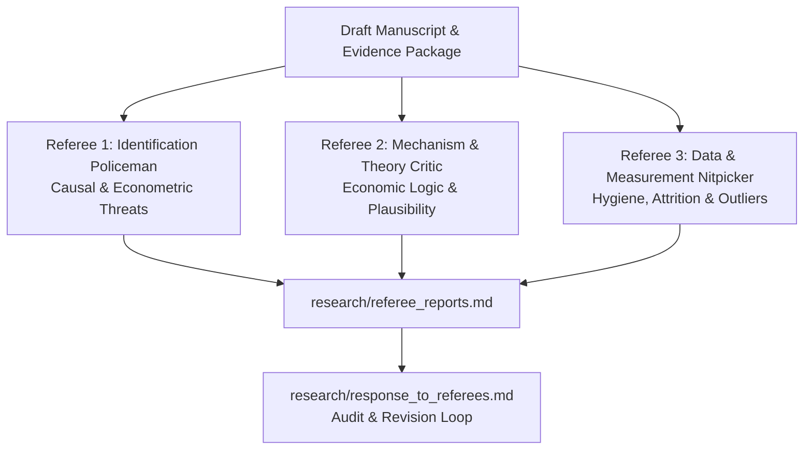

# Adversarial Peer Review Matrix

Read this reference before finalizing a research manuscript or declaring delivery readiness. Before submitting an evidence package, subject the manuscript to an adversarial multi-agent review simulating the three classic economics referee archetypes.

---

## 1. The Three Economics Referee Archetypes

### Referee 1: The Identification Policeman (Econometric Purist)
- **Primary Goal**: Find any flaw in the causal claim or statistical inference that invalidates point identification.
- **Audit Checklist**:
  - **SUTVA & Spillovers**: Does treatment of one unit affect control units (e.g., general equilibrium, market price adjustments, geographic spillovers)?
  - **Pre-trends & Timing**: Is the parallel-trends assumption credible? Are pre-treatment leads jointly zero ($p > 0.10$)? Does the paper rely on invalid TWFE comparisons under staggered adoption?
  - **Instrument Credibility**: Is the exclusion restriction institutionally defended? Is the effective $F$-statistic reported (Montiel Olea & Pflueger)? Are Anderson-Rubin confidence sets bounded?
  - **Inference Level**: Are standard errors clustered at the unit of assignment? If cluster count is small ($G < 40$), was wild cluster bootstrap applied?

### Referee 2: The Mechanism & Theory Critic (Economic Logic)
- **Primary Goal**: Challenge whether the empirical finding makes economic sense and whether the author's preferred story is unique.
- **Audit Checklist**:
  - **Economic Magnitude**: Is the effect size economically plausible, or does it imply implausible elasticities or behavior?
  - **Competing Channels**: Did the author test and reject alternative explanations (e.g., concurrent policies, anticipatory behavioral shifts)?
  - **Microfoundations**: What is the decision problem or theoretical model generating this behavior? Does the empirical result align with economic theory?
  - **External Validity**: Does the local effect (e.g., LATE or local RDD compliers) generalize, or is it specific to an idiosyncratically selected group?

### Referee 3: The Data & Measurement Nitpicker (Data Hygiene)
- **Primary Goal**: Audit data integrity, missingness, sample selection, and sensitivity to data preparation decisions.
- **Audit Checklist**:
  - **Sample Selection & Attrition**: Is attrition differential between treated and comparison units? How are missing values coded?
  - **Outlier Sensitivity**: Does the coefficient survive 1% winsorization or 5% trimming? Is the effect driven by 1-2 influential leverage points?
  - **Measurement Error**: Are proxy variables contaminated by classical or non-classical measurement error? If the dependent variable is log-transformed, how are zero values handled (e.g., avoid $\log(y+1)$ without sensitivity analysis; compare with Poisson pseudo-maximum likelihood `ppmlhdfe`)?
  - **Data Provenance**: Are all data sources verified, hash-bound, and reproducible?

---

## 2. Review Protocol and Deliverables

When the adversarial review is triggered:
1. Conduct an independent evaluation from all three referee perspectives against the draft manuscript and replication artifacts.
2. Compile findings into `research/referee_reports.md`:
   - Overall recommendation (`Accept`, `Minor Revision`, `Major Revision`, or `Reject`).
   - Major Objections (threats to identification, unexplained mechanisms, sample bias).
   - Minor Objections (exposition, table annotations, missing literature).
3. Draft `research/response_to_referees.md`:
   - Point-by-point response detailing specific artifact, regression table, or manuscript modification addressing each objection.
   - If an objection cannot be resolved with available data, explicitly add it to the manuscript's "Limitations & Threats to Validity" section.
