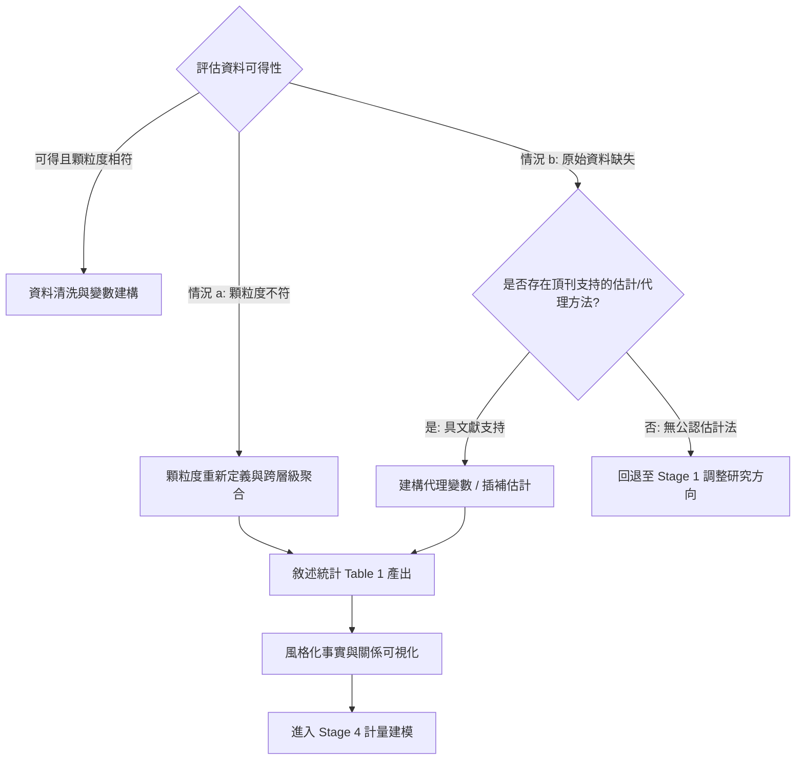

# 經濟資料顆粒度轉換與缺失應對指南 (Data Granularity & Feasibility Guide)

本指南規範 Stage 3 的資料探勘、空間/時間顆粒度轉換（Aggregation Protocols）、敘述統計產出、變數關係可視化、以及當資料真正缺失時的替代估計法與回退機制。

---

## 一、 資料困境兩大分支決策樹

---

## 二、 情況 a：顆粒度重新定義與聚合規範 (Granularity Transformations)

當原始資料的觀測頻率或空間層級與理論核心假說不完全匹配時，應遵循經濟學統計聚合原則轉換顆粒度：

### 1. 空間層級轉換 (Spatial Aggregation)

| 原始顆粒度 | 目標顆粒度 | 聚合操作規則 | 經濟意涵與注意事項 |
| :--- | :--- | :--- | :--- |
| **微觀點位 (廠房/門市/學校/公共設施)** | 縣級 (County) / 鄉鎮市區 / 郵遞區號 | 空間疊加 (Spatial Join)、距離加權密度、半徑內計數或暴露度總合 | 考量空間外溢邊界，設定理論切合之核心半徑 (如 5km, 15km) |
| **人口普查區 (Tract) / 郵遞區號 (ZIP)** | 縣 (County) / 通勤區 (CZ) | 使用 HUD-USPS 或人口權重交叉對照表 (Crosswalk) 加權彙總 | 嚴禁單純算術平均；必須以人口或就業人數作為權重 |
| **縣級 (County)** | 通勤區 (CZ) / 大都會區 (MSA) / 州 (State) | 本地勞動市場通常以通勤區 (CZ) 為邊界；總合變數直接加總，率指標人口加權 | 依據 David Autor 通勤區對照表；州級政策應對應至州或 CZ |

### 2. 時間頻率轉換 (Temporal Aggregation)

將高頻資料（如逐筆交易、分時用電、日資料）轉為低頻資料（月、季、年資料）時，必須嚴格區分**流量 (Flow)** 與 **存量 (Stock)** 變數：

1. **流量變數 (Flows)**：如總用電度數、發電量、產值、投資額、稅收。
   - 規則：使用區間**總和 (Sum)**。
   - 範例：$\text{Annual Electricity Consumed}_{it} = \sum_{d \in t} \text{Daily Consumed}_{id}$。
2. **存量變數 (Stocks)**：如員工人數、設備裝置容量、資本額、失業率。
   - 規則：使用**期末值 (End-of-period)** 或 **期間平均值 (Period Average)**，並於研究中明確交代定義。
3. **價格與物價指數 (Prices & Indices)**：如每度電價、租金、工資率。
   - 規則：使用**交易量加權平均 (Volume-weighted Average)** 或幾何平均，並以實質基期平減（如 CPI / PPI deflator）。

---

## 三、 情況 b：資料真正缺失時之替代估計法 (Proxy & Imputation Methods)

若核心變數在特定區域或歷史年份缺乏官方統計，Agent 應優先檢驗是否存在**經濟學頂刊（Top 5 / A+）認可的估計方案**：

| 缺失之核心變數 | 頂刊認可之替代估計法 (Proxy / Estimation) | 代表性權威文獻 | 適用邊界與限制 |
| :--- | :--- | :--- | :--- |
| **地方微觀 GDP / 產值** | 夜間燈光遙測資料 (Satellite Nighttime Lights, VIIRS / DMSP) | Henderson, Storeygard, & Weil (2012, *AER*) | 開發中國家、小行政區；注意頂部飽和效應 |
| **地方政策不確定性** | 地方報紙關鍵詞文本分析 (Text-based EPU) | Baker, Bloom, & Davis (2016, *QJE*) | 需建立清晰詞典與人工校準 (Audit) |
| **特定產業地方就業** | Bartik / Shift-Share 全國外生衝擊與初始份額合成估計 | Goldsmith-Pinkham et al. (2020, *AER*) | 初始份額需具外生性或事前平穩 |
| **追蹤資料局部隨機缺失** | 矩陣補全法 (Matrix Completion) / 合成對照插補 | Athey, Bayati, Doudchenko, Imbens, & Khosravi (2021, *JASA*) | 僅適用隨機缺失 (MAR)，不適用嚴重樣態自選擇 |

> **回退警戒線 (Hard Stop Rule)**：  
> 若該變數之代理估計無 A 級以上論文支撐，或代理變數之衡量誤差預期會嚴重稀釋估計係數（嚴重衰減偏差），Agent **必須停止強行實證**，直接觸發回退協定（Loopback to Stage 1），重新修正研究選題或更換研究對象市場。

---

## 四、 敘述統計 Table 1 規範

實證研究之起點必須提供清晰、可複製的「Table 1: Summary Statistics」。必須包含：
1. **觀測體系維度**：明確標註單元 $N$、時間跨度 $T$、總觀測數 $N \times T$ 及是否為平衡追蹤資料（Balanced Panel）。
2. **核心欄位**：Mean、SD（標準差）、Min、P25、P50（中位數）、P75、Max。
3. **分組檢驗 (Balance Table)**：若為準實驗研究，必須報告「處理組 vs. 對照組在基期 (Baseline) 的均值差異與 $t$ 檢定 $p$-value」。

---

## 五、 變數關係風格化事實可視化 (Stylized Facts Visualizations)

在進入計量迴歸前，必須透過圖形直觀展示變數核心關係：
1. **分箱散佈圖 (Binned Scatterplot / `binscatter`)**：
   - 依據 Chetty et al. 方法，將解釋變數分為 20~50 個等量分箱，計算組內均值，疊加線性或多項式擬合線，直觀排除異常點干擾。
2. **殘差化散佈圖 (Residualized Scatterplot)**：
   - 根據 Frisch-Waugh-Lovell 定理，先將 $Y$ 與 $X$ 分別對固定效應及共變數進行投影求得殘差 $\tilde{Y}, \tilde{X}$，再繪製殘差散佈圖，呈現純淨因果斜率。
3. **時間序列趨勢對比圖 (Raw Trend Plots)**：
   - 處理組與對照組在政策介入前後的原始水準趨勢對比，初步驗證平行趨勢直覺。
